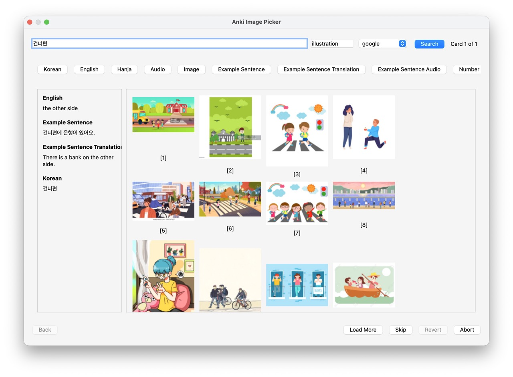
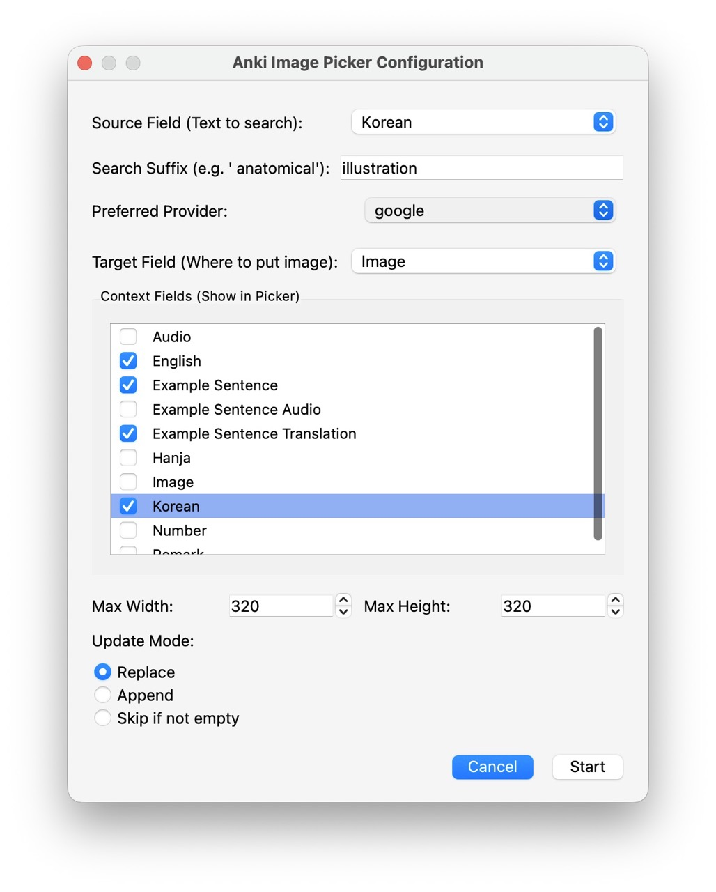

# Anki Image Picker

Quickly add images from web search to your Anki flashcards. Select multiple notes, pick images interactively from a grid, and move on - no blind batch downloads.



## Features

- **Interactive selection** - See thumbnails before adding, pick with a click or keyboard (1-8)
- **Batch processing** - Select multiple notes, process them one by one
- **Multiple search providers** - Bing, DuckDuckGo, or Google Images via API (bring your own key)
- **Smart search** - Auto-strips HTML and cloze markers from search terms
- **Field context** - Use other fields to refine searches on the fly
- **Session control** - Go back, skip, abort, or revert all changes

> **Note on Google Images:** Direct scraping of Google Images is no longer possible (Google now requires full client-side JavaScript rendering). However, you can still search Google Images by providing your own API key from [SerpApi](https://serpapi.com/) or [Serper.dev](https://serper.dev/). See [Google Images via API](#google-images-via-api) below.

## Installation

### From AnkiWeb (Recommended)
1. Open Anki → Tools → Add-ons → Get Add-ons...
2. Enter code: `647779979`
3. Restart Anki

### Manual Installation (to be added)
1. Download the latest release from GitHub Releases
2. Extract to your Anki add-ons folder
3. Restart Anki

## Usage

1. In the **Browser**, select one or more notes
2. Right-click → **Anki Image Picker...**
3. Configure:
   - **Source field** - Field containing search terms (e.g., "Word")
   - **Target field** - Where images will be added (e.g., "Picture")
   - **Mode** - Replace, Append, or Skip existing images



4. Click an image or press **1-8** to select and advance
5. Use **Skip** to skip a card, **Back** to revisit previous cards

Settings are remembered per note type, so you only need to configure once.

## Google Images via API

Google Images can be used through a paid API service. Both [SerpApi](https://serpapi.com/) and [Serper.dev](https://serper.dev/) offer free tiers, so you can try them without paying.

### Setup

1. Sign up for an API key:
   - **SerpApi** — [serpapi.com](https://serpapi.com/) (100 free searches/month)
   - **Serper.dev** — [serper.dev](https://serper.dev/) (2,500 free queries on signup)
2. In Anki, go to **Tools → Add-ons**, select **Anki Image Picker**, and click **Config**
3. Add your API key(s) to the JSON config:
   ```json
   {
       "serpapi_key": "your_serpapi_key_here",
       "serper_key": "your_serper_key_here"
   }
   ```
4. Restart Anki. The new provider(s) will appear in the provider dropdown — only when a key is configured.

You can set up one or both services. If you don't add any API keys, everything works as before with Bing and DuckDuckGo.

## Keyboard Shortcuts

| Key | Action |
|-----|--------|
| 1-8 | Select image |
| Enter | Confirm selection |
| Esc | Skip current card |

## Requirements

- Anki 2.1.54 or later (Qt6)

## See Also

Other image add-ons for Anki:

- [Anki Image Bulk Automatic Downloader](https://ankiweb.net/shared/info/863034630) - Paid, automatic download
- [Quick Images Downloader](https://ankiweb.net/shared/info/8280891) - Bulk download via Google API
- [Batch Image Downloader](https://ankiweb.net/shared/info/1004335882) - Batch download (Qt5)
- [Batch Download Pictures From Google Images](https://ankiweb.net/shared/info/561924305) - Batch download

**How is this different?** The add-ons above download images automatically based on search terms. Anki Image Picker lets you **see and choose** from multiple candidates before inserting - no blind downloads.

## License

MIT
